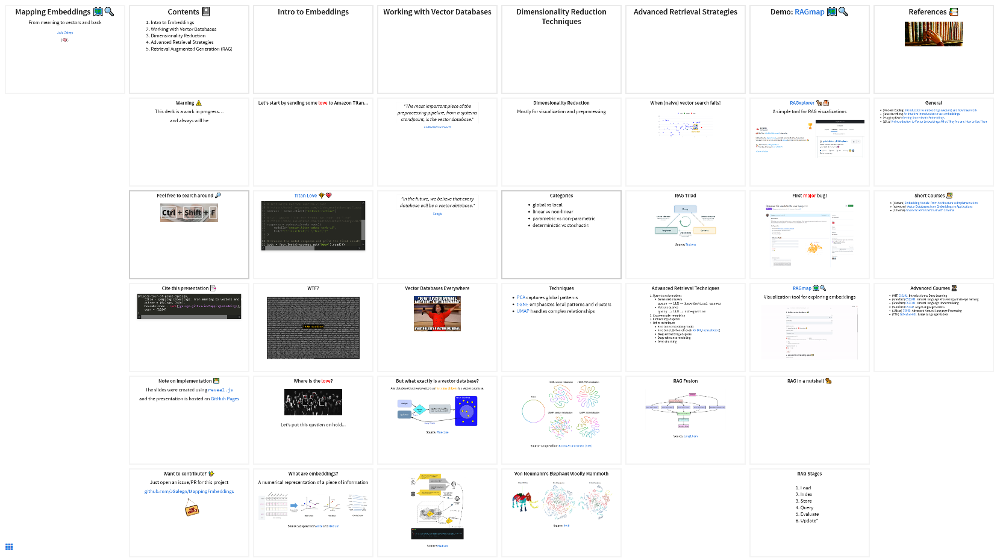

# Mapping Embeddings 🗺️🔍

## Overview

Interactive and extended version of [Mapping embeddings: from meaning to vectors and back](https://community.aws/content/2eoCtgociSBhGfirRM0Tk0PSgxH/mapping-embeddings-from-meaning-to-vectors-and-back).

## Want to contribute?

Just open an issue/PR for this project

